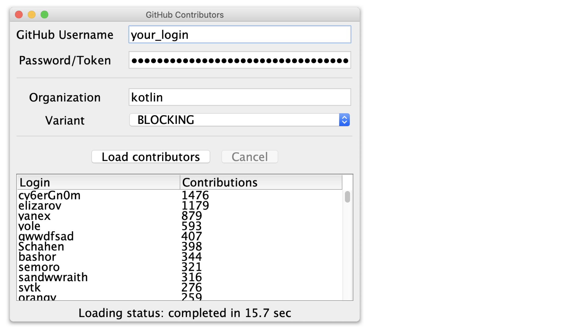

# Blocking request

We use developer github API, which performs the requests under your account (uses your password and authentication token
you've provided).

We use [Retrofit](https://square.github.io/retrofit/) to perform HTTP requests to Github.
It allows us to request the list of repositories under the given organization,
and request the list of contributors for each repository:

```kotlin
interface GitHubService {
    @GET("orgs/{org}/repos?per_page=100")
    fun getOrgReposCall(
        @Path("org") org: String
    ): Call<List<Repo>>

    @GET("repos/{owner}/{repo}/contributors?per_page=100")
    fun getRepoContributorsCall(
        @Path("owner") owner: String,
        @Path("repo") repo: String
    ): Call<List<User>>
}
```

The function `loadContributorsBlocking` defined in `src/tasks/Request1Blocking.kt`
uses this API to fetch the list of contributors for the given organization.
Let's see how it is implemented:

```kotlin
fun loadContributorsBlocking(req: RequestData) : List<User> {
    val service = createGitHubService(req.username, req.password)
    val repos = service
        .getOrgReposCall(req.org)          // #1
        .execute()                         // #2
        .also { logRepos(req, it) }        // #3
        .body() ?: listOf()                // #4

    return repos.flatMap { repo ->
        service
            .getRepoContributorsCall(req.org, repo.name)      // #1
            .execute()                                        // #2
            .also { logUsers(repo, it) }                      // #3
            .bodyList()                                       // #4
    }.aggregate()
}
```

At first, we get the list of repositories under the given organization and store it in the `repos` list.
Then for each repository, we request the list of contributors and merge all the obtained lists having one final list
of contributors as a result.

Each of `getOrgReposCall` and `getRepoContributorsCall` returns us an instance of `Call` class (lines `#1`).
At this point, no request is sent. 
We invoke `Call.execute` to perform the request (`#2`).
`execute` is a synchronous call which blocks the underlying thread.

When we get the response, we log the result by calling the specific `logRepos()` and `logUsers()` functions (`#3`).
If HTTP response contains an error, this error will be logged here.

At last, we need to get the body of the response which contains the desired data.
For simplicity of this tutorial, we'll only log the error if one appeared and use an empty list as a result in the case
of error (`#4`).
To avoid repeating `.body() ?: listOf()` many times, 
we declare an extension function `bodyList`:

```kotlin
fun <T> Response<List<T>>.bodyList(): List<T> {
    return body() ?: listOf()
}
```   

`logRepos` and `logUsers` log the received information straight away.
While running the code, look at the system output, you should see something like this:

```
1770 [AWT-EventQueue-0] INFO  Contributors - kotlin: loaded 40 repos
2025 [AWT-EventQueue-0] INFO  Contributors - kotlin-examples: loaded 23 contributors
2229 [AWT-EventQueue-0] INFO  Contributors - kotlin-koans: loaded 45 contributors
...
```

At first goes the number of milliseconds passed from the program start, then the thread name in square brackets.
You can see from which thread the loading request was called on.
At last, stays the actual message: how many repositories or contributors were loaded.

This log demonstrates that all the results were logged from the main thread.
When you run the code under `BLOCKING` request, you find that the window is frozen and doesn't react to your input
until the loading is finished.
All the requests are executed from the same thread as you've called `loadContributorsBlocking` from,
which is main UI thread (in case of Swing it's AWT event dispatching thread).
This main thread gets blocked, and that explains why UI is frozen:


After the list of contributors is loaded, the result is updated.
If you look at how `loadContributorsBlocking` is called, you'll find out that the `updateResults` goes right
after `loadContributorsBlocking` call:

```kotlin
val users = loadContributorsBlocking(req)
updateResults(users, startTime)
```

You can find this code in `src/contributors/Contributors.kt`;
the function `loadContributors` is responsible for choosing which way
the contributors should be loaded.
`updateResults` is the function that updates the UI, thus it must be always called from the UI thread.

To get familiar with the task domain (the knowledge we'll base upon later), please do the following simple task.
At the moment, if you run the code, you'll see that each contributor name is repeated several times, once for every
project they take part in. Your task is to implement the `aggregate` function combining the users so that each 
contributor was present only once. The `User.contributions` property should contain the total number of contributions
of the given user to *all* of the projects.
The resulting list should be sorted in a descending order by the number of contributions.

#### Task

Open `src/tasks/Aggregation.kt` and implement `List<User>.aggreate()` function.
The `main` function in the same file shows an example of the expected output.

After implementing this task, the resulting list for `Kotlin` organization should be similar to the following:



Note how the users are sorted by the total number of their contributions.  


#### Solution

One of the possible solutions is the following:

```kotlin
fun List<User>.aggregate(): List<User> =
    groupBy { it.login }
        .map { (login, group) -> User(login, group.sumBy { it.contributions }) }
        .sortedByDescending { it.contributions }
```

First, we group users by their login.
`groupBy` returns a map from login to all occurrences of user with this login in different repositories.
Then for each map entry we count the total number of contributions for each user and 
create a new instance of `User` class by given name and sum of contributions.
At last, we sort the resulting list in a descending order.

The alternative is to use the function `groupingBy` instead of `groupBy`.
