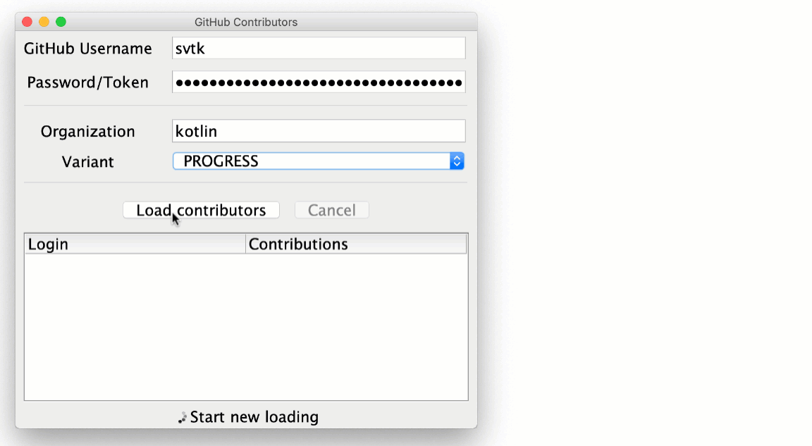

# Showing progress

Despite the information for some repositories is loaded rather fast,
the user sees the resulting list only after all the data is loaded.
Until then, the loader icon is running showing the progress, but there's no information what's the current state,
and what contributors are already loaded.  
However, we could show the intermediate results earlier and display all the contributors after loading the data
for each of the repository:



To implement this functionality, you'll pass the logic updating the UI as a callback, so that it was called on
each intermediate state:

```kotlin
suspend fun loadContributorsProgress(
    req: RequestData,
    suspend updateResults: (List<User>, completed: Boolean) -> Unit
) {
    // loading the data
    // calling `updateResults` on intermediate states 
}
```

On the call-site, you pass the callback updating the results from the `Main` thread: 

```kotlin
launch(Dispatchers.Default) {
    loadContributorsProgress(service, req) { users, completed ->
        withContext(Dispatchers.Main) {
            updateResults(users, startTime, completed)
        }
    }
}
```

Note that `updateResults` parameter is declared as `suspend` in `loadContributorsProgress`.
You need that in order to call the `suspend` function `withContext` inside the corresponding lambda argument.

Note also that `updateResults` callback now takes an additional `Boolean` parameter as an argument saying whether 
all the loading completed and our results are final.

#### Task

Implement the function `loadContributorsProgress` that shows an intermediate progress (in the `Request6Progress.kt` file).
Base it on the `loadContributorsSuspend` function (from `Request4Suspend.kt`).
We use the simple version without concurrency so far; we'll discuss how to add concurrency to this solution in the next section. 

Note that the intermediate list of contributors should be shown in an "aggregated" state, not just the list of users
loaded for each repository.
The total numbers of contributions for each user should be increased when the data for each new repository is loaded. 

#### Solution

You need to store the intermediate list of loaded contributors in an "aggregated" state.
You can define `allUsers` variable which stores the list of users and is updated
after contributors for each new repository are loaded: 

```kotlin
suspend fun loadContributorsProgress(
    service: GitHubService,
    req: RequestData,
    updateResults: suspend (List<User>, completed: Boolean) -> Unit
) {
    val repos = service
        .getOrgRepos(req.org)
        .also { logRepos(req, it) }
        .bodyList()

    var allUsers = emptyList<User>()
    for ((index, repo) in repos.withIndex()) {
        val users = service.getRepoContributors(req.org, repo.name)
            .also { logUsers(repo, it) }
            .bodyList()

        allUsers = (allUsers + users).aggregate()
        updateResults(allUsers, index == repos.lastIndex)
    }
}
```

`updateResults` callback is called after each request is completed: 


We don't use any concurrency so far. This code is sequential, so we don't need synchronization.

How to add concurrency to this solution?
Channels solve that.
